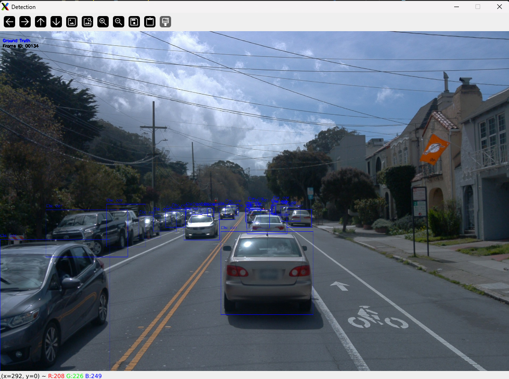

# Dataset_analysis
This repository containing the scripts for Waymo dataset analysis:
- Waymo loader class for parsing data
- Visualization of image and bounding boxes
- Interactive Visualization tool

## TODOs
- [x] Function for saving files in output dir
- [ ] Add pcd data processing in waymo_loader.py 
- [ ] Include transformation matrices for ego, LiDAR and Camera
- [ ] Implement pcd visualization

### Preview of data

Front Camera Image and Bounding boxes |
:-------------------------:
  |  

## Getting started
1. Setup the environment
```
# Clone the repo
git clone git@github.com:gaurav00700/WaymoDatasetAnalysis.git
cd WaymoDatasetAnalysis

#Create the Python environment
conda create -n waymo python=3.9 -y && conda activate waymo

conda activate waymo
pip install --upgrade pip

#Install using requirements
pip install -r requirements.txt
```

2. Download dataset from [Waymo Dataset website](https://waymo.com/open/download/) and organize folder as shown below
```
├── waymo_v_1_4_1
│  ├── training
│  │  ├── individual_files_training_segment-{sequence_name}_with_camera_labels.tfrecord
|  │  ...
```
1. Run the script [Waymo](scripts/waymo_dataset_analysis.py)
```
python scripts/waymo_dataset_analysis.py
```

## Folder structure

```
├── data (contains input and output files)
│ ├── input (files required for scripts)
│ ├── output(Folders for respective script output)  
├── lib (contains modules python files)
│ ├── waymo_loader.py
│ ├── tools.py
│ ├── utils.py 
│ ├── visualization.py
├── scripts (contains main script python files)  
│ ├── waymo_dataset_analysis.py
```
